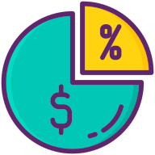

# Binance Margin

Introducing "Binance Margin": the ultimate companion app for cryptocurrency enthusiasts and traders alike. With "Binance Margin," you can stay ahead of the game by effortlessly tracking your token trade gains, entry prices, and overall account performance from a specific date. Here's what makes our app stand out:

1. **Real-Time Gain Tracking:** Keep a close eye on your individual token trade gains (PNL) with real-time updates. Whether you're making small adjustments or executing big trades, "Binance Margin" provides you with accurate and up-to-date information on your gains.

2. **Entry Price Monitoring:** Never lose track of your entry prices again. Our app allows you to monitor your entry prices for each token trade, helping you make informed decisions and strategize your next moves effectively.

3. **Comprehensive Account Performance:** Gain valuable insights into your overall account performance from a specific date. With detailed statistics and analysis, you can evaluate your trading strategies and optimize your portfolio for maximum returns.

4. **Graphical Representation:** Visualize your trading journey with ease using our intuitive graphs. Choose from various time frames – 1 day, 1 week, 1 month, 1 year, or view all data at once – and analyze your performance trends effortlessly.

5. **Historical Trade and Order Visualization:** Explore your past trades and current orders conveniently within the app. Dive into historical data to review your past decisions, learn from your experiences, and refine your trading strategies for future success.

With its user-friendly interface, powerful features, and insightful analytics, "Binance Margin" empowers you to take control of your cryptocurrency trading journey like never before. Download now and unlock the full potential of your trading portfolio!

## Usage

Create a binance.properties file and add you the following keys:

```
API_KEY="YOUR_API_KEY"
SECRET_KEY="YOUR_SECRET_KEY"
BASE_URL="https://api.binance.com"
TESTNET_URL="https://testnet.binance.vision"
```

The start date at the moment is hardcoded within the com.codeskraps.core.client.BinanceClient class. You can change the date to your desired start date.

![screenshot_one][screenshot_one]

[screenshot_one]: store_assets/Screenshot_20240222_120641_Binance.jpg